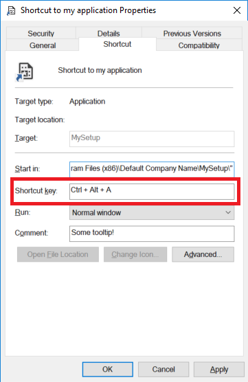

# Register Shortcut key for Application during setup
 This example shows how you can register a shortcut key for the application during setup. Then you can open the application by shortcut key.

Users can register the shortcutkey for shortcuts in properties window of the shortcut. This example shows how to do it programmatically during setup:

To setup a shortcut key for a shortcut, you can use `WshShell.CreateShortcut` to get/create a `IWshShortcut` object and then assign a shortcut key combination to its `Hotkey` property:

    object strDesktop = (object)"Desktop";
    string shortcutAddress = (string)WshShell.SpecialFolders.Item(ref strDesktop)
                                + @"\Shortcut to my application.lnk";
    IWshRuntimeLibrary.IWshShortcut oShellLink = 
        (IWshRuntimeLibrary.IWshShortcut)WshShell.CreateShortcut(shortcutAddress);
    oShellLink.Hotkey = "Ctrl+Alt+A";
    oShellLink.Save();

The interface also contains other properties which yo umay use to setup the shortcut:

    [DefaultMember("FullName")]
    [Guid("F935DC23-1CF0-11D0-ADB9-00C04FD58A0B")]
    [TypeLibType(4160)]
    public interface IWshShortcut
    {
        [DispId(2000)]
        [TypeLibFunc(64)]
        void Load(string PathLink);
        [DispId(2001)]
        void Save();

        [DispId(0)]
        string FullName { get; }
        [DispId(1000)]
        string Arguments { get; set; }
        [DispId(1001)]
        string Description { get; set; }
        [DispId(1002)]
        string Hotkey { get; set; }
        [DispId(1003)]
        string IconLocation { get; set; }
        [DispId(1004)]
        string RelativePath { set; }
        [DispId(1005)]
        string TargetPath { get; set; }
        [DispId(1006)]
        int WindowStyle { get; set; }
        [DispId(1007)]
        string WorkingDirectory { get; set; }
    }